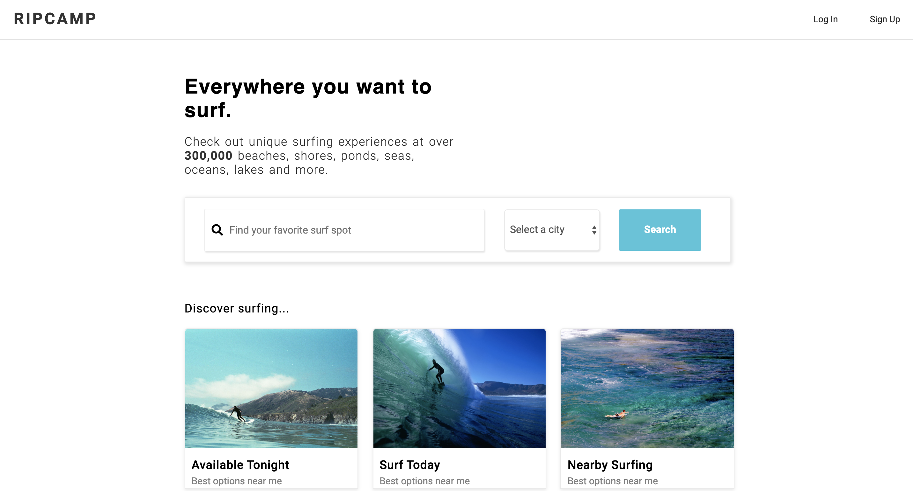
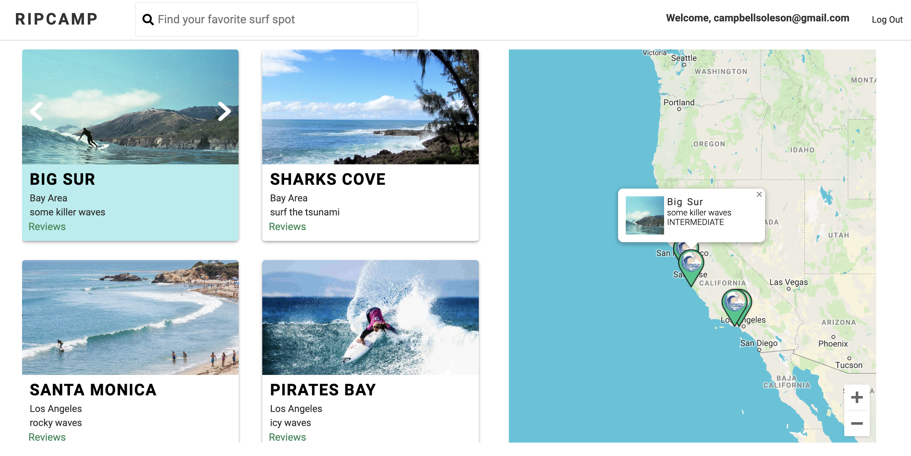
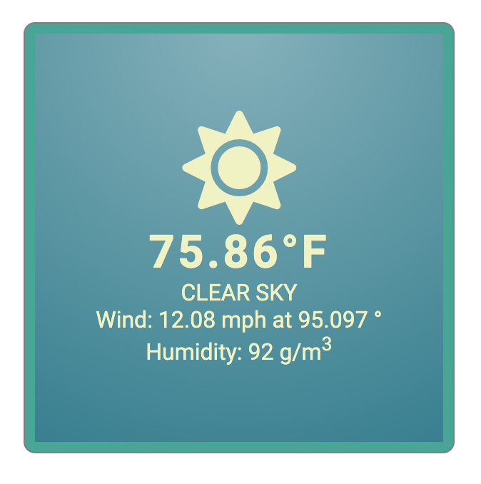
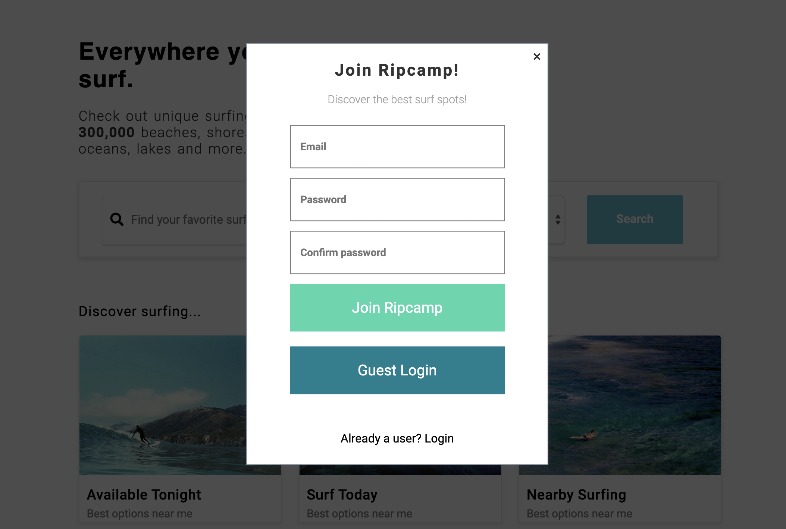

# [RipCamp](https://ripcamp.herokuapp.com/)

RipCamp is the go-to website for finding all of the best surf. Users can navigate the globe using RipCamp's map-based interface to find the locations of surf spots anywhere. RipCamp also has information on individual surf spots, including a description, difficulty level, and local weather conditions. 

RipCamp is built with **ExpressJS, MongoDB, and React/Redux on the frontend.** It also encorperates **Google Maps API** for the map interface, and **Open Weather API** for weather conditions. 



## Features

   **Map/Index**
   
- RipCamp's primary interface is a map that users can navigate in search of surf spots. Surf spots on the map have markers indicating their locations. 
- The index on the left-hand side of the screen displays the surf spots that are within the bounds of the map. If you navigate away from the surf spots on the map, they will disappear from the index.
- Underlying this is a bounds-based query system that uses the latitude/longitude of the corners of the map to query the database for surf spots within range, which are then displayed on the map and in the index. 

```
  listenBounds(map) {
    map.addListener("idle", () => {
      this.updateMapBounds(MAP);
    });
  }

  updateMapBounds(map) {
    const bounds = map.getBounds();

    const northEast = bounds.getNorthEast();
    const southWest = bounds.getSouthWest();
    const bounds_obj = {
      northEast: { lat: northEast.lat(), lng: northEast.lng() },
      southWest: { lat: southWest.lat(), lng: southWest.lng() }

    };
    this.props.updateFilter("bounds", bounds_obj);
  }
```

- The map also features dynamic UX/UI. When you mouseover a map marker for a surf spot, the index will scroll to display that surf spot and highlight it. Similarly, if you mouseover a surf spot in the index, the info bubble on its respective map marker will open. 



   **Weather**

- RipCamp uses the latitude/longitude of a given surf spot to fetch the local weather conditions from Open Weather API. Weather conditions are displayed on the surf-spot show page.



What are you waiting for? Sign Up!


